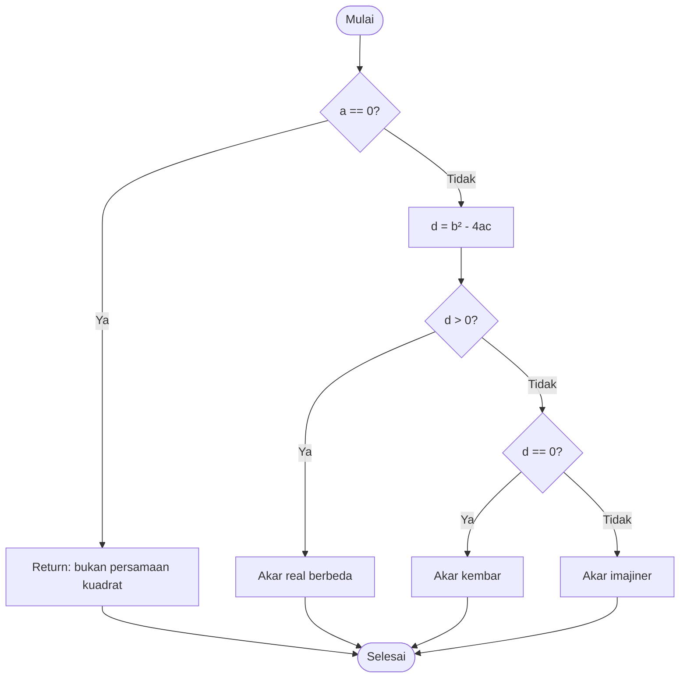
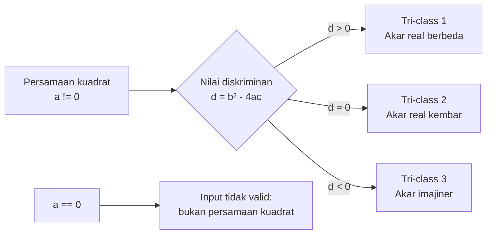
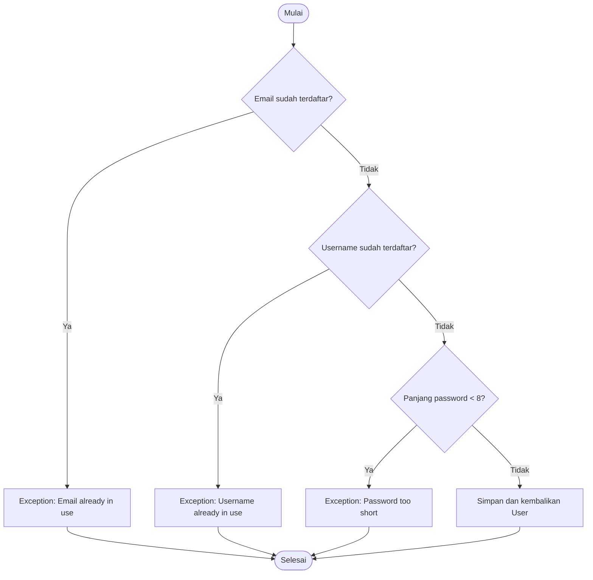

# Analisis Path & Branch Coverage (White-Box Testing)

Dokumen ini merupakan pengumpulan analisis white-box testing untuk:

1. Persamaan kuadrat `2x² - 8x + 6 = 0`.
2. Analisis percabangan method `registerUser(...)` pada proyek Spring Petclinic.

## 1. Analisis Persamaan Kuadrat

### Persamaan

`2x² - 8x + 6 = 0`, dengan:

- `a = 2`
- `b = -8`
- `c = 6`

### Kode implementasi Java

```java
public void hitungAkar(double a, double b, double c) {
    if (a == 0) {
        return; // Bukan persamaan kuadrat
    }

    double d = (b * b) - (4 * a * c);

    if (d > 0) {
        // Akar real berbeda
    } else if (d == 0) {
        // Akar kembar
    } else {
        // Akar imajiner
    }
}
```

### Diagram CFG



### Diagram tri-class diskriminan

Tri-class membagi nilai diskriminan ke dalam tiga kelas ekuivalen. Validasi `a == 0` diperlakukan sebagai kondisi prasyarat terpisah karena input tersebut bukan persamaan kuadrat.



### Cyclomatic complexity dan branch coverage

Dengan `E = 12` edge dan `N = 10` node:

```text
V(G) = E - N + 2
     = 12 - 10 + 2
     = 4
```

Artinya, diperlukan minimal empat test case independen untuk mencakup seluruh branch.

| Test case | Kondisi | Contoh input `(a, b, c)` | Output yang diharapkan |
|---|---|---|---|
| TC-Q1 | `a == 0` | `(0, 2, 1)` | Bukan persamaan kuadrat |
| TC-Q2 | `d > 0` | `(2, -8, 6)` | Akar real berbeda: `x₁ = 3`, `x₂ = 1` |
| TC-Q3 | `d == 0` | `(1, -4, 4)` | Akar kembar: `x = 2` |
| TC-Q4 | `d < 0` | `(1, 2, 5)` | Akar imajiner/kompleks |

Untuk persamaan utama, diskriminannya adalah:

```text
d = (-8)² - (4 × 2 × 6)
  = 64 - 48
  = 16 > 0
```

Sehingga:

```text
x₁ = (8 + √16) / 4 = 3
x₂ = (8 - √16) / 4 = 1
```

## 2. Analisis Proyek Spring Boot

### Repository open source yang dirujuk

Repository yang diminta untuk dicantumkan pada tugas adalah:

**[spring-projects/spring-petclinic](https://github.com/spring-projects/spring-petclinic)**

Namun, repository tersebut tidak mendefinisikan package `io.spring.application.user` atau
method `UserService.registerUser(...)`. Oleh karena itu, bagian ini bukan klaim bahwa
method tersebut berasal dari Petclinic. Kode dan analisis berikut adalah contoh mandiri
yang diberikan pada soal, sedangkan link Petclinic dicantumkan sebagai repository open
source yang dirujuk untuk konteks tugas.

Package dan method pada contoh soal:

- Package: `io.spring.application.user`
- Class: `UserService`
- Method: `registerUser(...)`

> Analisis branch di bawah mengikuti struktur validasi `registerUser(...)` yang diberikan pada soal
> dan tidak dimaksudkan untuk dieksekusi terhadap source tree Petclinic.

### Struktur logika method

```java
public User registerUser(UserRegistrationParam param) {
    if (userRepository.findByEmail(param.getEmail()).isPresent()) {
        throw new IllegalArgumentException("Email already in use");
    } else if (userRepository.findByUsername(param.getUsername()).isPresent()) {
        throw new IllegalArgumentException("Username already in use");
    } else if (param.getPassword().length() < 8) {
        throw new IllegalArgumentException("Password too short");
    } else {
        return userRepository.save(new User(param));
    }
}
```

### Diagram alur `registerUser`



### Cyclomatic complexity dan branch coverage

Method memiliki tiga keputusan berurutan, sehingga:

```text
V(G) = jumlah keputusan + 1
     = 3 + 1
     = 4
```

Empat skenario berikut mencakup semua jalur utama:

| Test case | Kondisi input/skenario | Jalur eksekusi | Output yang diharapkan |
|---|---|---|---|
| TC-U1 | Email sudah ada di database | Branch `if` pertama | Error `Email already in use` |
| TC-U2 | Email baru, username sudah ada | Branch `else if` pertama | Error `Username already in use` |
| TC-U3 | Email dan username baru, password kurang dari 8 karakter | Branch `else if` kedua | Error `Password too short` |
| TC-U4 | Email dan username baru, password minimal 8 karakter | Branch `else` terakhir | Mengembalikan user baru |

Dengan TC-U1 sampai TC-U4, seluruh hasil keputusan (`true` dan `false`) serta jalur sukses telah diuji sehingga target branch coverage adalah **100%** untuk struktur method yang dianalisis.

## Kesimpulan

Analisis persamaan kuadrat membutuhkan empat test case untuk mencakup validasi `a == 0` dan tiga tri-class diskriminan (`d > 0`, `d == 0`, dan `d < 0`). Analisis `registerUser(...)` juga membutuhkan empat test case untuk mencakup tiga validasi kegagalan dan satu jalur registrasi berhasil.
